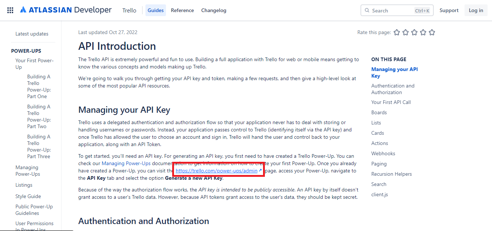
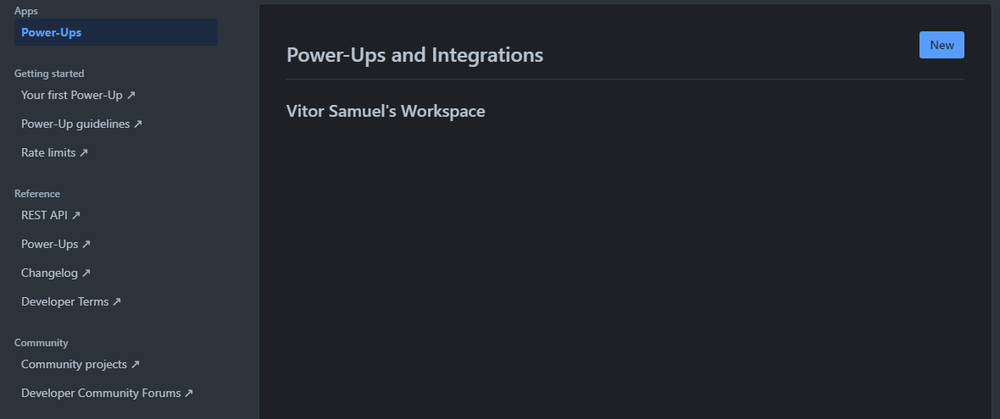
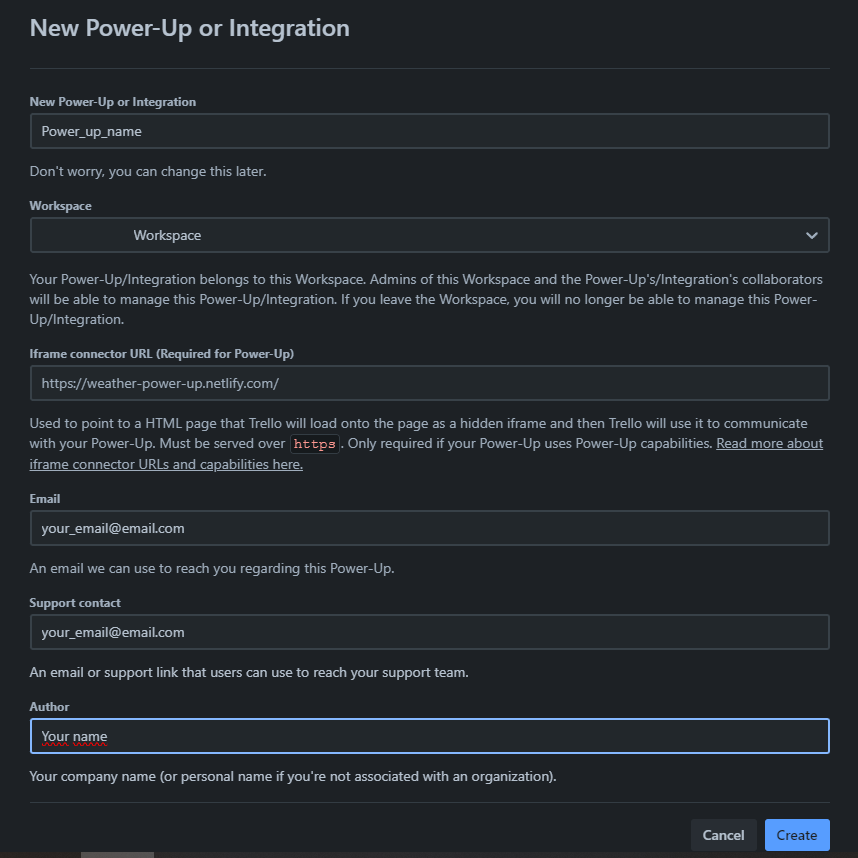
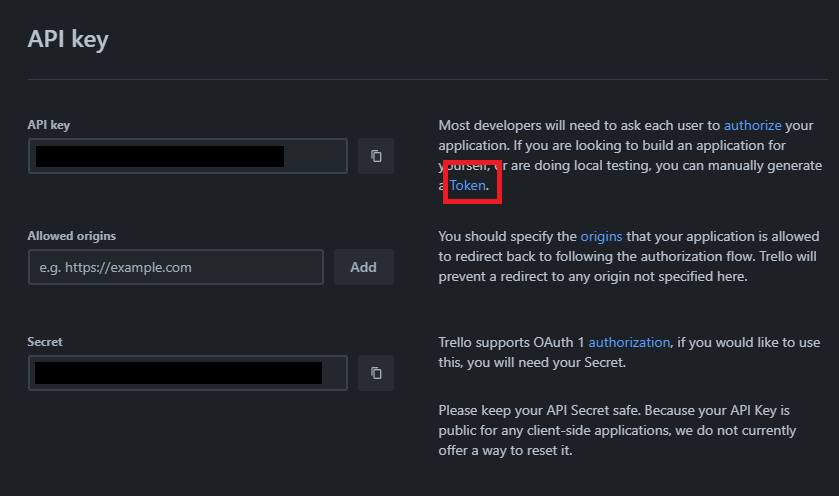
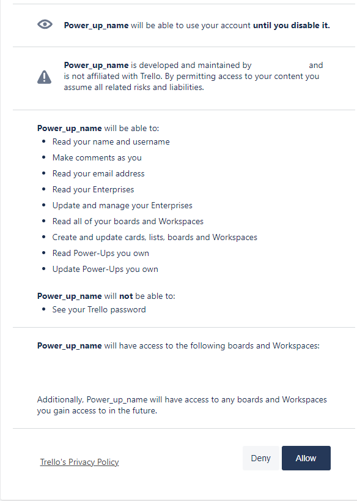
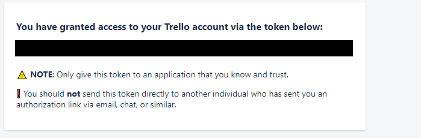

# Gerador-automatico-de-listas-organizadas-para-trello
 Gerador automático de listas organizadas para trello, a partir de um prompt fornecido pelo cliente

 # Site de Apresentação
 [GALO AI Site de apresentação](https://vitorsvnascimento.github.io/GALO-AI-Site-de-apresentacao/)

# Requerimentos básicos
- python 3.10.10
- chave de api trello (Como obter no final do README)
- token de api trello (Como obter no final do README)
- chave de api galaxyAI (ou outra api que consulte a api openAI com modelo gpt-3.5 turbo) (Como obter no final do README)

# Como utilizar o projeto
## Supondo que todos os requisitos básicos tenham sido atendidos 
1. Clone ou faça download do projeto
2. Vá até a pasta raiz do projeto
3. Crie o ambiente virtual de sua preferencia. Exemplo

        python -m venv venv
4. Execute o ambiente virtual. Exemplo

        .\venv\Scripts\activate
5. Após entrar no ambiente virtual instale as bibliotecas necessárias a partir do arquivo requirements.txt
        
        pip install -r requirements.txt

6. Altere o nome do arquivo ".env_editable" para ".env"

7. Edite o arquivo fornecendo suas chaves de API

8. Caso você esteja usando outra API diferente da Galaxy AI edite O VALOR da variavel GALAXY_BASE_URL para a url base da sua api

9. na raiz do projeto execute o comando 
        
        python ./start.py

10. Acesse o link local do servidor

# Como obter a chave de API e token Trello 

1. Acesse o site [API Introduction Trello](https://developer.atlassian.com/cloud/trello/guides/rest-api/api-introduction/) e faça login na sua conta

2. Após efetuar o login clique no link destacado na imagem abaixo

3. Após isso, na página de power-ups clique no botão "New"

4. Preencha o formulario com os dados solicitados e clique em create

5. Após isso clique no botão "Generate a new API key", e confirme na janela modal que irá aparecer.

6. Pronto! Sua chave de API está gerada, agora falta o token, na tela onde voce encontra a chave de api clique no link destacado na imagem abaixo

7. Na página a seguir clique em allow

8. Após isso você receberá seu token

# Como obter a chave de API galaxy AI

1. Entre no servidor do discord da API [Galaxy AI [Andromeda]](https://discord.gg/fmMqUUXShN)
2. Faça sua autenticação no servidor 
3. Após isso entre no canal de texto command e digite o comando "/generate"
4. Pronto agora você obteve sua chave